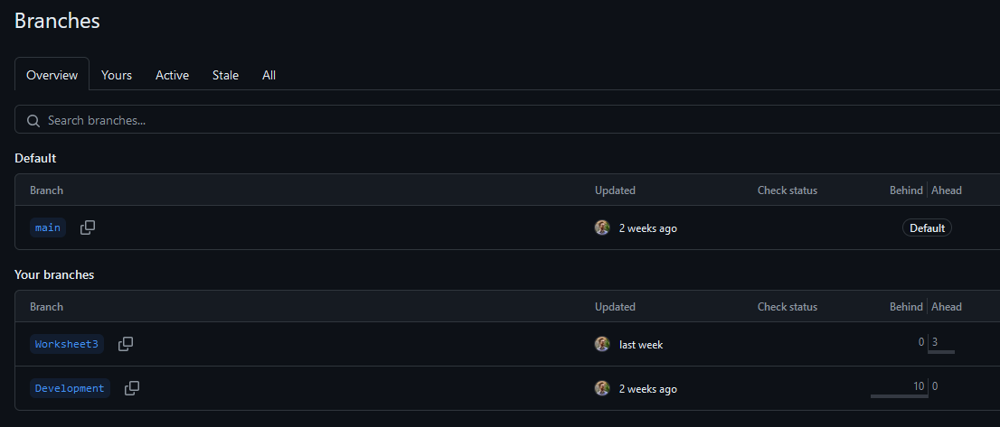
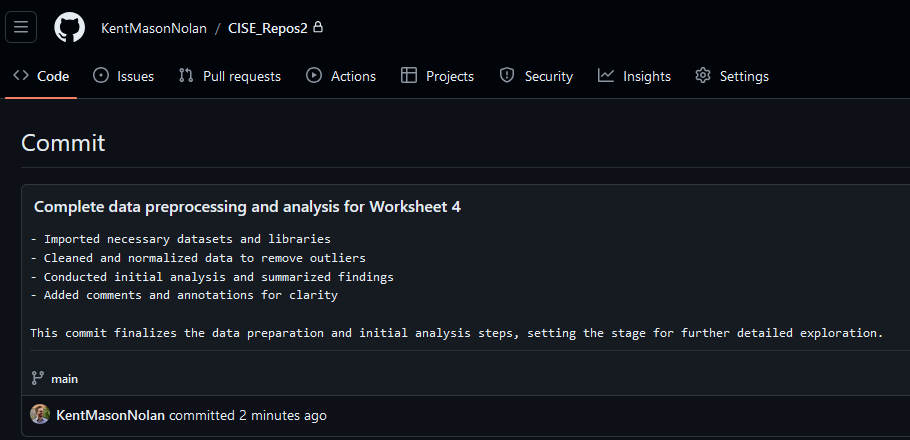
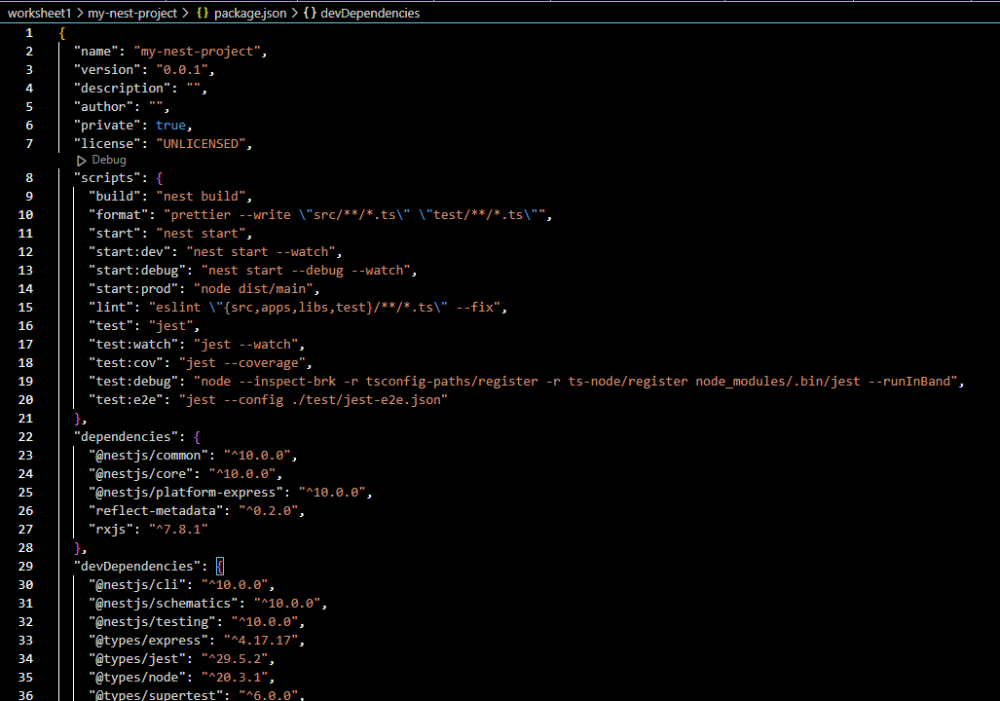

## CISE_Repos

# ENSE701 - Week 1 - Lab Evidence

**This markdown will answer the following questions:**

1.	What is the purpose of Git and GitHub? 
2.	Explain the difference between a local repository and a remote repository in the context of Git and GitHub.
3.	What is the role of README.md file in a GitHub repository? 
4.	Explain the purpose of creating branches in GitHub. A screenshot(s) to support your answer may be suitable to show your “Development” branch.
5.	Explain the steps you took to merge your changes to the main branch on GitHub. A screenshot(s) to support your answer may be suitable.
6.	Provide an example of one of your commit messages, adhering to a commit message standard. A screenshot here may be suitable.  
7.	What is the "create-react-app" script used for? A screenshot(s) to support your answer may be suitable to evidence your successful creation of the cise-react-learn React application.
8.	What are the roles of the package.json and .gitignore files in a React application?
9.	Explain the purpose of a pull request in GitHub. A screenshot(s) to support your answer may be suitable, to evidence the open pull request for merging the "LogoLink" branch with the Development branch.
10.	A screenshot(s) to support your answer may be suitable to evidence the successful creation of a new project using NEST CLI and running of the NEST application.
11.	A screenshot(s) to support your answer may be suitable to evidence changes you made to the getHello() function in the src/app.controller.ts file of the NEST application and the updated message in the browser.

### Questions

## 1.	*What is the purpose of Git and GitHub?*

Git:

    Version Control: Git tracks changes in code, manages versions, and supports collaboration by allowing developers to work on the same project simultaneously.
    Branching and Merging: Developers can work in isolated branches and merge their work into the main project when ready.

GitHub:

    Repository Hosting: GitHub hosts Git repositories online, making it easy to share and back up code.
    Collaboration Tools: GitHub provides tools like pull requests and issues to manage and review code changes, facilitating teamwork.
    Community: GitHub also serves as a social platform for developers to showcase and collaborate on projects.

## 2. *Difference Between Local and Remote Repositories*

    Local Repository: A local repository is stored on your personal computer. It contains all the files, commit history, and branches that you're working on. Changes made locally are only visible on your machine until you push them to a remote repository.

    Remote Repository: A remote repository is hosted on a server, like GitHub, and can be accessed by others. It serves as a central location where the code is stored and shared. Developers can clone, pull, and push changes between their local and remote repositories, enabling collaboration.

## 3. Role of README.md in a GitHub Repository

    The README.md file is a markdown file that typically serves as the main documentation for a GitHub repository. It provides an overview of the project, including its purpose, how to install and use it, and any other relevant information. When someone visits the repository, the README.md file is usually displayed on the front page, making it the first thing users see.
    

## 4. Purpose of Creating Branches in GitHub

    Branches in GitHub allow developers to work on different features, fixes, or experiments in isolation from the main codebase (usually the main or master branch). This enables multiple parallel development efforts without interfering with the stable version of the project. Once the work on a branch is complete, it can be merged back into the main branch, integrating the new features or fixes.

    See below for images made for Week 1:

## 6.	Provide an example of one of your commit messages, adhering to a commit message standard. A screenshot here may be suitable.  

I've always been someone who commits code frequently, often as a way to ensure my work is saved and backed up at various stages of development. However, I've realized that while my habit of committing often is beneficial for tracking progress, my commit messages haven't always been up to standard. They were often too vague or lacked the necessary detail to be useful in the long run.

Recognizing this, I've been making a conscious effort to improve the quality of my commit messages. I'm working on being more descriptive and consistent, following best practices to ensure that each commit clearly communicates what changes were made and why. This not only helps me when I revisit my work but also makes it easier for anyone else reviewing the code to understand the evolution of the project. Improving my commit messages is a small but important step towards becoming a more effective and responsible developer.

This was a key one for me: https://www.freecodecamp.org/news/how-to-write-better-git-commit-messages/

But, here is an example of me doing a better job:

## 7.	What is the "create-react-app" script used for? 

The create-react-app script is a command-line tool used to quickly set up a new React application with a standardized project structure and configuration. It provides a pre-configured environment with everything you need to start developing a React app without worrying about setting up build tools like Webpack, Babel, or ESLint.
Key Features:

- Zero Configuration: You can start coding in React immediately without needing to configure build tools manually.

- Standard Project Structure: It generates a folder structure that follows best practices, helping maintain a clean and organized codebase.

- Development and Build Scripts: It comes with built-in scripts for running a development server, testing, and building the app for production.

- Optimized Build: The production build created by create-react-app is optimized for performance and includes features like code splitting and asset optimization.

## 8.	What are the roles of the package.json and .gitignore files in a React application?

package.json:

I selected this package.json configuration because it represents a critical component of the backend Nest.js project within the overall application. This file defines the dependencies, scripts, and testing framework that are essential for building, running, and maintaining the backend services.

Overall, I gained a deeper understanding of how to structure and manage a Node.js project using Nest.js. I learned how to set up various scripts for development, production, and testing, which streamline the development process. I also explored how Jest is configured within a Nest.js project to handle unit and integration testing.

One surprising aspect was the comprehensive configuration options available within the package.json file, particularly how Jest integrates with TypeScript through ts-jest to enable testing in a TypeScript environment. I was also surprised by how easy it is to customize the development workflow by modifying the scripts section, which allows for different modes of operation like start:dev, start:debug, and start:prod.

.gitignore:

Ignoring Files in Version Control: The .gitignore file specifies which files and directories should be ignored by Git when committing to the repository. This is important for keeping the repository clean and avoiding unnecessary files in version control.

For a React project, .gitignore typically includes:

- node_modules/: This directory contains installed dependencies and is not needed in version control since they can be reinstalled via package.json.
- build/ or dist/: These are output directories created by the build process, which are generally not included in the repository.
- Environment files, like .env, which may contain sensitive information such as API keys.

## 9.	Explain the purpose of a pull request in GitHub. 
A pull request in GitHub allows developers to propose changes to a codebase by submitting their work from one branch to be merged into another, usually the main branch. It's a key tool for collaboration, enabling others to review, comment on, and approve the changes before they are integrated. This process helps maintain code quality, encourages team discussion, and ensures that all changes are properly tested and documented before becoming part of the main project.