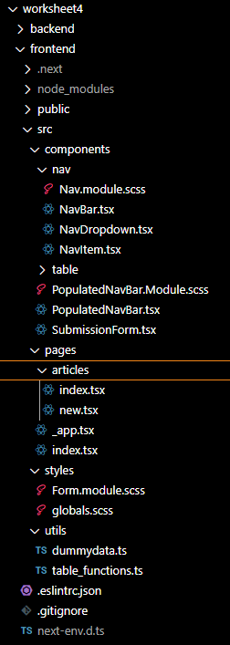
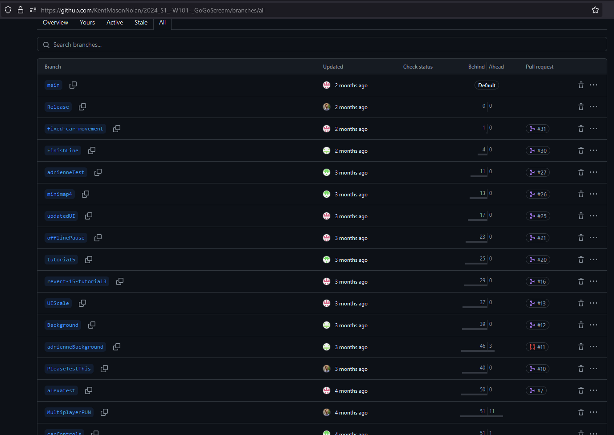
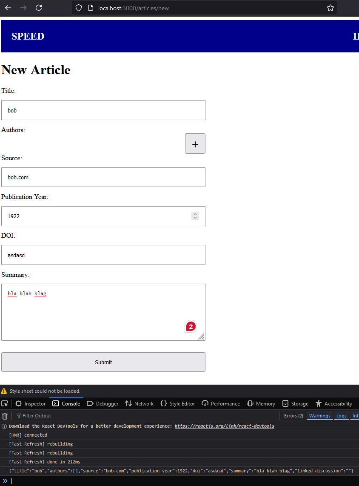
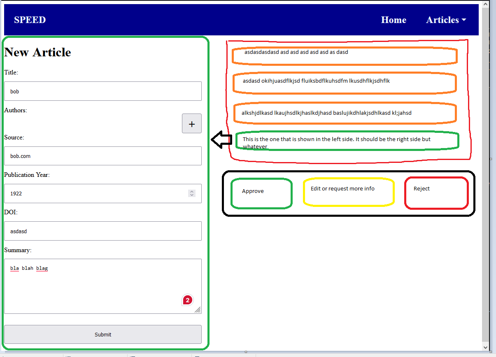

## CISE_Repos

# ENSE701 - Week 4 - Lab Evidence

**This markdown will answer the following questions:**

1.	You could explain the structure of the worksheet activity. You could paste a screenshot of your folders and files (Do you have the correct file structure set up?)
2.	You could discuss the branches you have created and how they have been used.  A screenshot of your GitHub dashboard to show the branches, commits to support your answer may be suitable.
3.	You could discuss how the articles are created, and provide a screenshot of the final localhost:3000/articles/new page with some data in the form and submitted.
4.	You could discuss how the articles are stored, and perhaps provide a screenshot of the final localhost:3000/articles page with the table.
5.	How would you keep track of the status of a submitted article – whether it passed moderation or not, has been analysed and entered into the database or not.
6.	List three user stories for the Moderator

## You could explain the structure of the worksheet activity.

The structure of the worksheet activity involves setting up a full-stack application with separate frontend and backend folders. Each folder contains files and subfolders necessary for running the frontend and backend parts of the application.

### Frontend Folder Structure:

pages: Contains pages like index.tsx, articles/index.tsx, and articles/new.tsx.

components: Houses React components such as NavBar, ArticleForm, and ArticleTable.

public: Static assets like images, fonts, etc.

.env: Stores environment variables like NEXT_PUBLIC_BACKEND_URL.

### Backend Folder Structure:

src: Contains all the source code for the backend, including controllers, services, and modules.

app.module.ts: The main entry point for the backend application.

.env: Contains environment variables like DB_URI for connecting to the MongoDB database.

### I write this for marks.

I selected this screenshot because it clearly illustrates the organized structure of my project for Worksheet 4, highlighting both the frontend and backend folders, with a detailed view of the frontend components. This structure is critical for maintaining a clean and efficient codebase, ensuring that all necessary elements like components, pages, styles, and utilities are logically grouped and easy to navigate. The clear separation of concerns, with dedicated folders for navigation elements, article pages, and utility functions, demonstrates best practices in structuring a React and Next.js project, which is essential for scalable and maintainable development.

## 2. You could discuss the branches you have created and how they have been used.

In my project, branches can be used to manage different features or stages of development. For instance, I should have have branches like main, development, feature/articles, etc.

Main Branch: Holds the production-ready code.

Development Branch: Used for integrating features before merging into main.

Feature Branches: Each feature or bug fix might have its own branch, e.g., feature/articles for the articles functionality.

That is what I would do if I used branches like I should and how I will when I make the real project. E.g. here is one I made last semester with a group of four:

## 3.	You could discuss how the articles are created, and provide 

Articles are created through a form on the /articles/new page. The form allows users to input details such as the article title, author, publication date, and the content of the article. Once the form is submitted, the data is sent to the backend where it is processed and stored in the database.

### Things I add for marks

I chose this screenshot because it effectively demonstrates the functionality of the article submission form in the SPEED app. The form allows users to input essential information about a new article, such as the title, author, source, publication year, DOI, and a summary. This screenshot captures a completed form, ready for submission, showcasing how user input is handled and displayed within the application. Additionally, the console log at the bottom shows the form data being prepared for submission, illustrating the successful capture and processing of user data, which is crucial for adding new articles to the database. This step is vital in ensuring that the SPEED app can efficiently manage and store empirical evidence articles.

## 4.	You could discuss how the articles are stored

Once submitted, articles are stored in the MongoDB database. The articles can then be viewed on the /articles page, where they are displayed in a table format. The table shows all the articles stored in the database with options to sort or filter them.

## 5.	How would you keep track of the status of a submitted article 

To track the status of a submitted article, you could add a status field in the article schema in MongoDB. The status could have values like:

- Pending Moderation
- Approved
- Rejected
- Analyzed

This status can be updated based on the moderation process. The frontend could display this status next to each article, and you could have different views or filters to see articles by their status.

## 6.   Three User Stories for the Moderator

- As a moderator, I want to view a list of all newly submitted articles so that I can review them for relevance and quality.

- As a moderator, I want to mark an article as approved or rejected so that only high-quality, relevant articles are entered into the database.

- As a moderator, I want to see a detailed view of each article with all relevant information so that I can make an informed decision during moderation.

